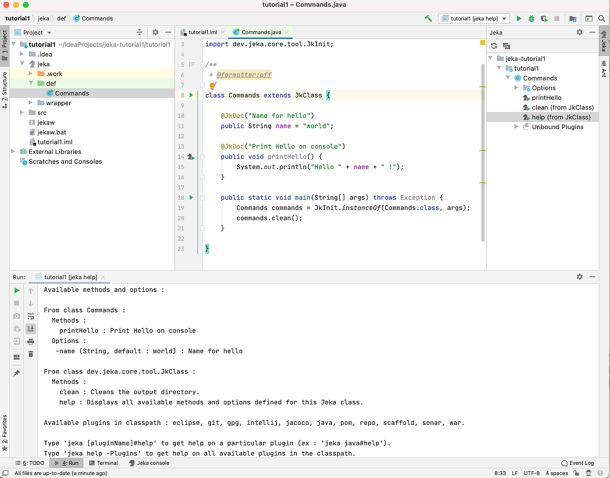
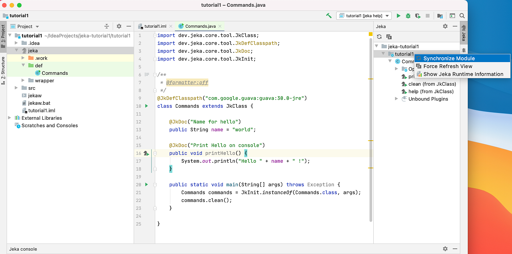
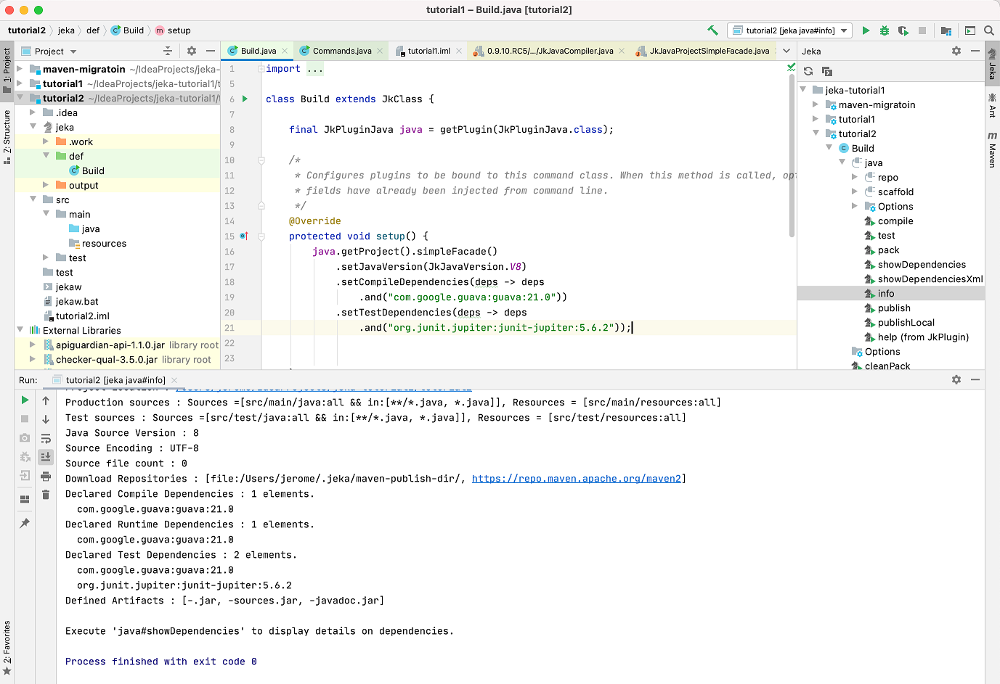

# How to use Jeka to create simple automation projects

The below example will show simple functions that can executed both in IDE and command line.

### Install Intellij Plugin

Install plugin directly from [here](https://plugins.jetbrains.com/plugin/13489-jeka)
or search _jeka_ in Intellij Marketplace.

### Hello World !

Right-click on a module, then _Jeka_ > _Generate Jeka files and folders..._

  
Dialog box will be open with default selection and click _OK_. 

The _Jeka_ folder structure will be generated with an empty _Jeka_ class.

On the right side of the IDE, nodes can be expanded to navigate on Jeka commands. These commands either come from the `JkClass` or plugin in classpath.

Click _Commands_ > _help_ to trigger the `help` method coming from `JkClass`.
This will display a contextual help from a list of all available commands and options.
The `help` command can be also invoked by using command line `./jekaw help`

You can now add your own commands just by declaring a public no-arg method returning `void`.

For adding options, just declare a public field as shown below.

The `helloWorld` command is invokable both from the IDE (run/debug) and from the command line using `./jekaw helloWorld -name=Joe`

You can write as many commands as you want in your Jeka classes, and your project can also contain many Jeka classes. 
The first Jeka class found is the default Jeka class (sorted by name/package). To run `doSomething` method on 
a class named `here.is.MyJekaCommands`, execute `./jekaw -JKC=MyJekaCommands doSomething`.

## Import 3rd Party libraries

Your Jeka classes can also use any third party libraries available on your file system or in a bynary repository.

Let's add *guava* to our Commands class : just add the `@JkDefClasspath` annotation and refresh ide module to 
make it available on IDE classpath.

  
Now you can use guava to improve your commands using *guava* inside.

  

# Create a Java Project

Jeka bundles Java project build capabilities. Of course, you can use your favorite build tool (Maven, Gradle, ...) 
beside Jeka in your project and let Jeka delegate builds to these tools, but you might prefer to let Jeka build 
your project by itself. Let's see how to do it.

Right click on folder or module > Jeka > Generate Jeka files and folders...

This opens a dialog box. Select *JAVA* and press OK.

The box *'delegate Jeka Wrapper to'* means that the module *tutorial-2* will reuse the same Jeka wrapper 
(and therefore the same Jeka version) than *tutorial-1*. That way, we can force all Java modules from a same Intellij 
project, to use the same Jeka Version, defined in one place.

  

This generates a Build template class in `jeka/def` along source folders.

You can launch directly any method declared on this class or navigate in Jeka right tool to discover methods available 
on this class or available plugin.

  
After modifying your dependencies, do not forget to refresh module in order intellij take it in account.
Invoke `cleanPack` to build project from scratch.

  
Now your project is ready to code. You will find many project examples at https://github.com/jerkar/working-examples

  

# Create a Springboot Project

Jeka offers a plugin mechanism to let 3rd parties extend the product. An external plugin for Springboot 
exists and is tightly integrated in Intellij Plugin.

Right click oo a module then _Jeka_ > _Generate Jeka files and folders..._

This opens a dialog box. Select *Springboot* and press OK.

This generates a sample project along its build class based on the last *Springboot* version.

You can invoke regular commands as *clean*,*pack*, ... The plugin offers additional commands 
to run the application from the built jar.

  

The plugin proposes popular _Spring_ modules as constant to help pickup dependencies.

