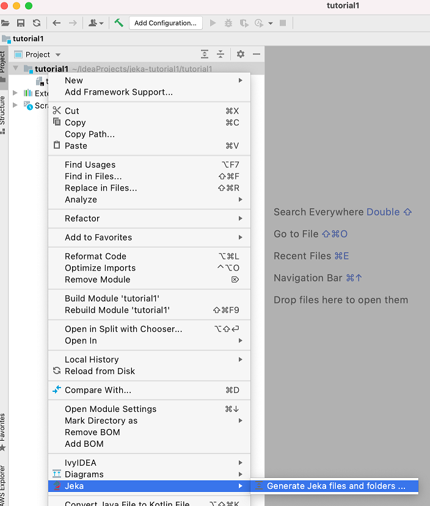

# Install Intellij Plugin

Install direcly plugin from [here](https://plugins.jetbrains.com/plugin/13489-jeka) 
or search 'jeka' in Intellij Marketplace

# Create a simple automation project

In this example, we will create a project to automate tasks (no Java project to build).

We will code simple functions that can executed both in IDE and in command line.

## Hello World !

Right click on folder or module > Jeka > Generate Jeka files and folders...

    
This opens a dialog box. Press OK.

    
This generates a Jeka folder structure with a empty Jeka class.

On the right side of your IDE, you can expand nodes to navigate on Jeka commands you can perform.

These commands come from either the JkClass or from plugin present in classpath.

Click Commands > help to trigger the `help` method coming from `JkClass`. This will display a contextual help for the available commands and options.

You can now add your own commands just by declaring a public no-arg method returning `void`.

For adding options, just declare a public field as shown below.

    

