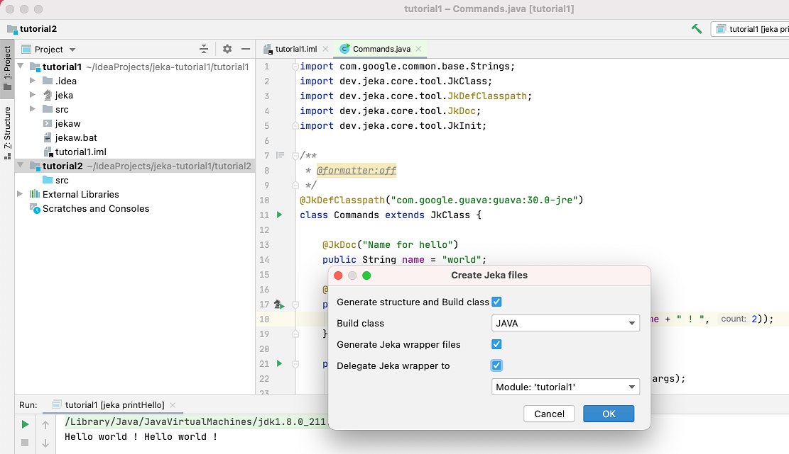
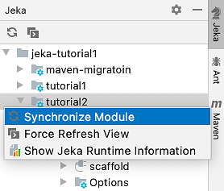

# Install Intellij Plugin

Install direcly plugin from [here](https://plugins.jetbrains.com/plugin/13489-jeka) 
or search 'jeka' in Intellij Marketplace

# Create simple automation projects

In this example, we will create a project to automate tasks (no Java project to build).

We will code simple functions that can executed both in IDE and in command line.

## Hello World !

Right click on folder or module > Jeka > Generate Jeka files and folders...

   
This opens a dialog box. Press OK.

    
This generates a Jeka folder structure with an empty Jeka class.

On the right side of your IDE, you can expand nodes to navigate on Jeka commands that you can perform. These commands come from either the JkClass or from plugin present in classpath.

Click *Commands > help* to trigger the `help` method coming from `JkClass`. 
This will display a contextual help for available commands and options.
You can also invoke the `help` command using command line `./jekaw help`

You can now add your own commands just by declaring a public no-arg method returning `void`.

For adding options, just declare a public field as shown below.

The `helloWorld` command is invokable both from the IDE (run/debug) and from the command line using `./jekaw helloWorld -name=Joe`

You can write as many commands as you want in your Jeka classes, and your project can also contain many Jeka classes. 
The first Jeka class found is the default Jeka class (sorted by name/package). To run `doSomething` method on 
a class named `here.is.MyJekaCommands`, execute `./jekaw -JKC=MyJekaCommands doSomething`.

## Import 3rd Party libraries

Your Jeka classes can also use any third party libraries available on your file system or in a bynary repository.

Let's add *guava* to our Commands class : just add the `@JkDefClasspath` annotation and refresh ide module to 
make it available on IDE classpath.

  
Now you can use guava to improve your commands using *guava* inside.

  

# Create a Java Project

Jeka bundles Java project build capabilities. Of course, you can use your favorite build tool (Maven, Gradle, ...) 
beside Jeka in your project and let Jeka delegate builds to these tools, but you might prefer to let Jeka build 
your project by itself. Let's see how to do it.

Right click on folder or module > Jeka > Generate Jeka files and folders...

This opens a dialog box. Select *JAVA* and press OK.

The box *'delegate Jeka Wrapper to'* means that the module *tutorial-2* will reuse the same Jeka wrapper 
(and therefore the same Jeka version) than *tutorial-1*. That way, we can force all Java modules from a same Intellij 
project, to use the same Jeka Version, defined in one place.

  

This generates a Build template class in `jeka/def` along source folders.

You can launch directly any method declared on this class or navigate in Jeka right tool to discover methods available 
on this class or available plugin.

  
After modifying your dependencies, don't forget to refresh module in order intellij take it in account.
Invoke `cleanPack` to build project from scratch.

  
Now your project is ready to code. You'll find many project examples at https://github.com/jerkar/working-examples

  

# Create a Springboot Project

Jeka offers a plugin mechanism that 3rd party to extend the product. An external plugin for Springboot 
exists, you can directly set it up using Intellij Plugin.

Right click on folder or module > Jeka > Generate Jeka files and folders...

This opens a dialog box. Select *Springboot* and press OK.

This generates a sample project along its build class based on the last *Springboot* version.

You can invoke regular commands as *clean*,*pack*, ... The plugin offers additional commands 
to run the application from the built jar.

  

The plugin offers popular Spring modules as Constants to help you add dependencies.

