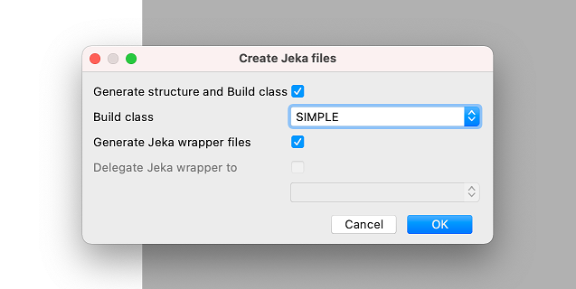
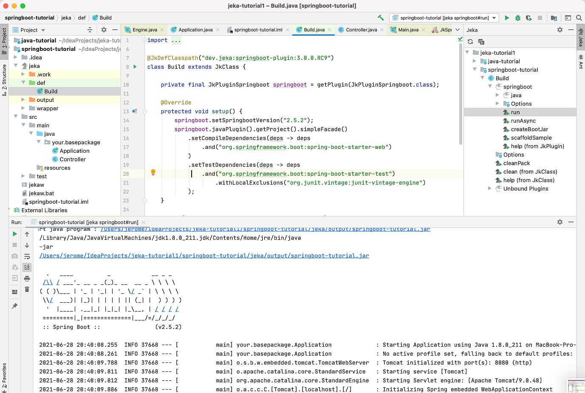
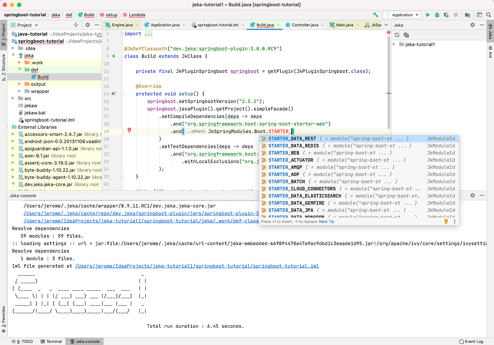

# Getting started with Jeka

Here, you will :
* [Intall Intellij Jeka plugin](#install)
* [Create a basic automation project](#helloworld)
* [Use 3rd party dependencies inside your build logic](#import)
* [Build a Java project with Jeka](#java)
* [Build a Springboot project with Jeka](#springboot)

## Install Intellij Plugin 

* Install plugin directly from [here](https://plugins.jetbrains.com/plugin/13489-jeka)
or search _jeka_ in Intellij Marketplace.

As this plugin embbeds its own version of _Jeka_, that's all you need to install on your machine.

## Hello World ! 

The below example showcases how to write tasks executable both from IDE and command line. 

* Create a basic Java module in Intellij : _New_ > _Module ..._ > _Java_ > _Next_ > _Finish_

* Right-click on the module, then _Jeka_ > _Generate Jeka files and folders..._

  
* Dialog box will be open with default setting

* Select *SIMPLE* and click _OK_

_You get the following..._

The _Jeka_ folder structure will be generated with an empty _Jeka_ class.

On the right side of the IDE, nodes can be expanded to navigate on Jeka commands. These commands either come from the `Commands` class or plugins present in classpath.

* Click _Commands_ > _help_ to trigger the `help` method coming from `Commands` class.
This will display a contextual help from a list of all available commands and options.
  
  
* Open a terminal and execute `./jekaw help`. This will execute the same but from the command line. For this, 
  `jekaw` compiles your `Commands` classes behind the scene and execute a Java program which invokes the method.

Now, you can now add your own commands (like `printHello` in above example) just by declaring a public no-arg method returning `void`.
Your new method should appear instantaneously in Jeka window tool on the right.

* For adding options, just declare a public field as shown below.

* Execute `./jekaw helloWorld -name=Joe` in terminal for invoking method while injecting option value.

You can write as many commands as you want, of any complexity. Also, your project can contain several Jeka classes.
The first Jeka class found is the default Jeka class (sorted by name/package).

To run `doSomething` method on a specific class named `here.is.MyJekaCommands`, execute `./jekaw -JKC=MyJekaCommands doSomething`.

[Learn more about Jeka command line](Reference%20Guide/1.1.%20Jeka%20Runtime.md)

## Import 3rd Party libraries 

Your Jeka classes can also use any third party libraries available on your file system or in a bynary repository.

Let's add *guava* to our Commands class : just add the `@JkDefClasspath` annotation and refresh ide module to 
make it available on IDE classpath.

 
Now you can use guava to improve your commands using *guava* inside.

 

## Build a Java Project 

Jeka bundles Java project build capabilities. Of course, you can use your favorite build tool (Maven, Gradle, ...) 
beside Jeka in your project and let Jeka delegate builds to these tools, but you might prefer to let Jeka build 
your project by itself. Let's see how to do it.

* Create a basic Java module in Intellij 

* Right-click on the module then _Jeka_ > _Generate Jeka files and folders..._

* This opens a dialog box. Select *JAVA* and press OK.

The box *'delegate Jeka Wrapper to'* means that the module *tutorial-2* will reuse the same Jeka wrapper 
(and therefore the same Jeka version) than *tutorial-1*. That way, we can force all Java modules from a same Intellij 
project, to use the same Jeka Version, defined in one place.

  

This generates a Build template class in `jeka/def` along source folders.

You can launch directly any method declared on this class or navigate in Jeka right tool to discover methods available 
on this class or available plugin.

  
After modifying your dependencies, do not forget to refresh module in order intellij take it in account.
Invoke `cleanPack` to build project from scratch.

  
Now your project is ready to code. You will find many project examples at https://github.com/jerkar/working-examples

[Learn more about Java project builds](Reference%20Guide/2.4.%20Java.md)

[Learn more about dependency management](Reference%20Guide/2.3.%20Dependency%20management.md)
 

## Build a Springboot Project 

Jeka offers a plugin mechanism to let 3rd parties extend the product. An external plugin for Springboot 
exists and is tightly integrated in Intellij Plugin.

* Create a new module in IntelliJ

* Right-click on a module then _Jeka_ > _Generate Jeka files and folders..._

* This opens a dialog box. Select *Springboot* and press OK.

This generates a sample project along its build class based on the last *Springboot* version.

You can invoke regular commands as *clean*,*pack*, ... The plugin offers additional commands 
to run the application from the built jar.

  

The plugin proposes popular _Spring_ modules as constant to help pickup dependencies.

You can also switch Springboot version easily by changing `#springbootVersion` argument.

**Do not forget to trigger 'Jeka Synchronize Module' available in context menues, each time you modify dependencies or change springboot version.
It let Intellij synchronize its iml file with dependencies declared in Jeka.**

