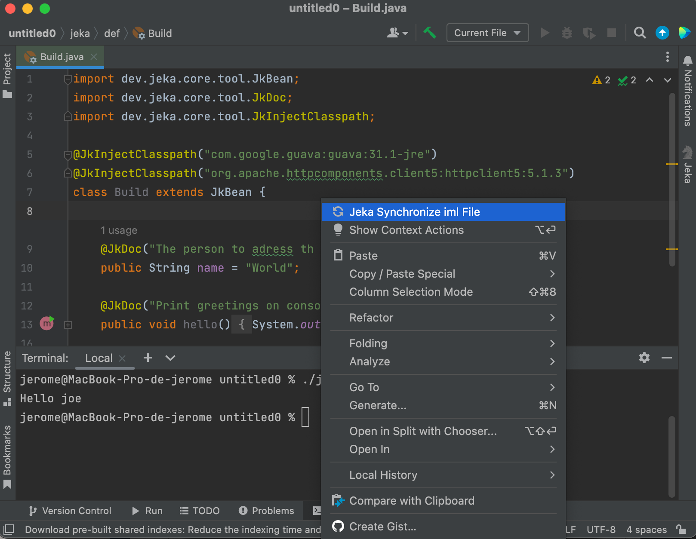

# Getting started with Jeka

## Install Intellij Plugin 

* Install plugin directly from [here](https://plugins.jetbrains.com/plugin/13489-jeka)
or search _jeka_ in Intellij Marketplace.

As this plugin embbeds its own version of _Jeka_, that's all you need to install on your machine.

## Hello World ! 

The below example showcases how to write tasks executable both from IDE and command line. 

* Create a new Jeka project in Intellij : _New_ > _Project ..._ > _Jeka_ 

Leave default (you might change the name) and press _Create_.

!!! Note
    Jeka structure (folders and files) can be created on an existing project from any type.
    On IntelliJ *project* window-tool : _Select project_ > Click Left > Jeka ... > Scaffold ...

You get a workable Jeka project from you can :

- execute/debug methods from the IDE using editor glutter buttons or tool-windows explorer.
- navigate to discover available kbeans on this project, and their content.
- create Intellij *run-configuration* from existing methods
- execute methods directly in the terminal (execute `./jekaw hello name=Joe` on a terminal)
- create new method/fields. If they do not appear on tool-window, use top menu button to refresh view.

## Import 3rd Party libraries 

You can also import 3rd-party libraries to use in your build classes by using `@JkInjectClasspath`annotation.

Libraries referenced with coordinates will come into classpath along all their dependencies.

Do not forget to refresh *iml* explicitly when Jeka classpath has been changed.

!!! Tip
    Use _Ctrl+space_ when editing `@JkInjectClasspath`  to get dependency auto-completion.

    

## Build a Java Project

It is possible to use your favorite build tool (Maven, Gradle, ...) beside Jeka in your project and let Jeka delegate builds.

It is also possible to build projects(compile, tests, jars, publish) using native Jeka capabilities.

1. Create a basic Java module in Intellij 

2. Right-click on the module then _Jeka_ > _Generate Jeka files and folders..._

This opens a dialog box. Select *PROJECT* and press OK.

!!! notes
    The box *'delegate Jeka Wrapper to'* means that the module *tutorial-2* will reuse the same Jeka wrapper 
    (and therefore the same Jeka version) than *tutorial-1*. That way, we can force all Java modules from a same Intellij 
    project, to use the same Jeka Version, defined in one place.

This generates a Build template class in `jeka/def` along source folders.

You can launch directly any method declared on this class or navigate in Jeka right tool to discover methods available 
on this class or available plugin.

After modifying your dependencies, do not forget to refresh module in order intellij take it in account.
Invoke `cleanPack` to build project from scratch.

Now your project is ready to code. You will find many project examples [here](https://github.com/jerkar/working-examples)

[Learn more about Java project builds](/reference-guide/build-library-project-build)

[Learn more about dependency management](/reference-guide/build-library-dependency-management)
 

## Build a Springboot Project 

Jeka offers a plugin mechanism to let 3rd parties extend the product. An external plugin for Springboot 
exists and is tightly integrated in Intellij Plugin.

* Create a new module in IntelliJ

* Right-click on a module then _Jeka_ > _Generate Jeka files and folders..._

* This opens a dialog box. Select *Springboot* and press OK.

This generates a sample project along its build class based on the last *Springboot* version.

You can invoke regular commands as *clean*,*pack*, ... The plugin offers additional commands 
to run the application from the built jar.

  

The plugin proposes popular _Spring_ modules as constant to help pickup dependencies.

You can also switch Springboot version easily by changing `#springbootVersion` argument.

!!! warning
    Do not forget to trigger 'Jeka Synchronize Module' available in context menues, each time you modify dependencies or change springboot version.
    It let Intellij synchronize its iml file with dependencies declared in Jeka.

