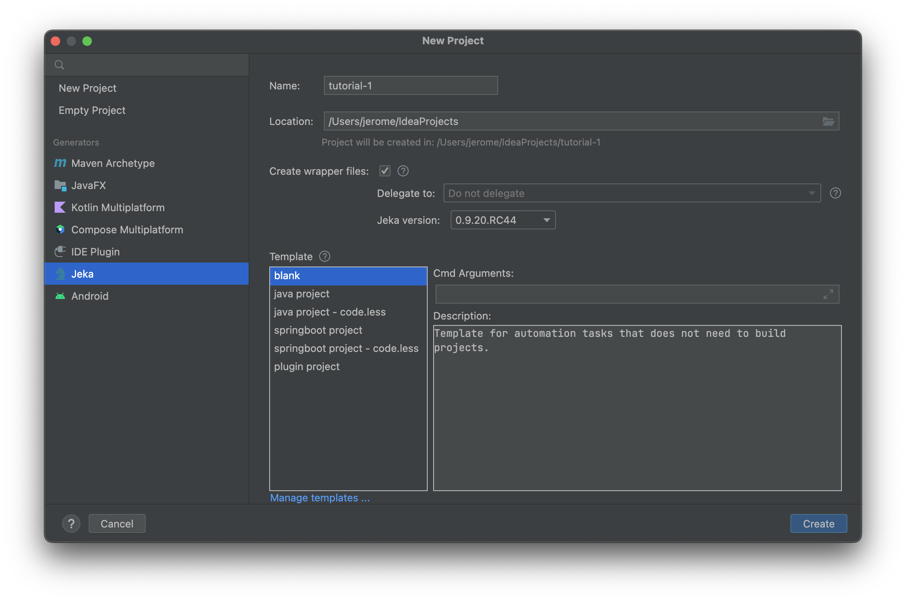
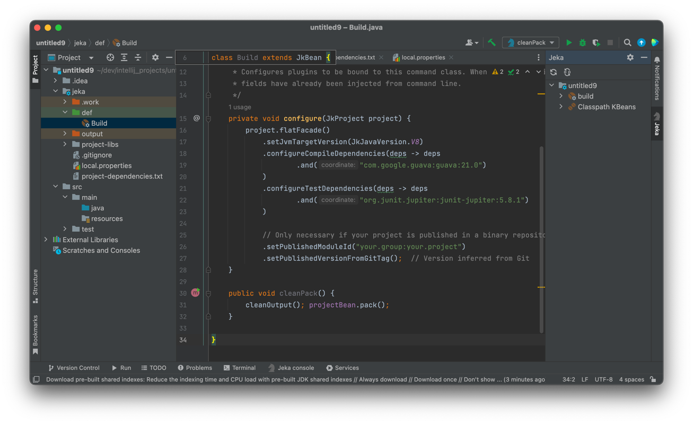
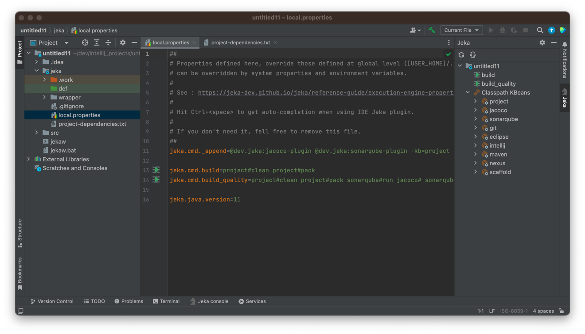
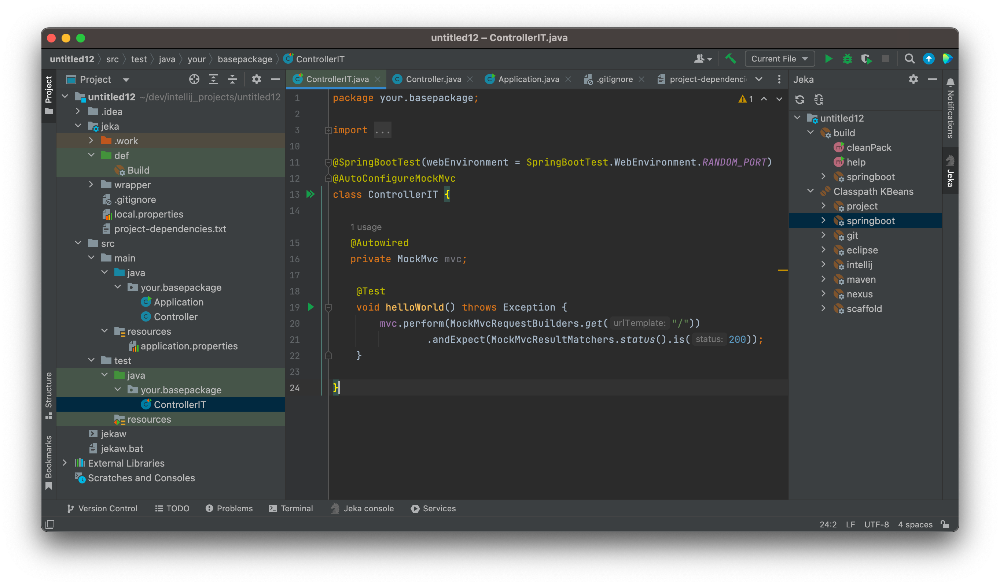

# Getting started with Jeka

## Install Intellij Plugin 

* Install plugin directly from [here](https://plugins.jetbrains.com/plugin/13489-jeka)
or search _jeka_ in Intellij Marketplace.

As this plugin embeds its own version of _Jeka_, that's all we need to install on our machine.

## Hello World ! 

The below example showcases how to write tasks executable both from IDE and command line. 

* Create a new Jeka project in Intellij : _New_ > _Project ..._ > _Jeka_ 

Leave default (we might change the name) and press _Create_.

!!! Note
    Jeka structure (folders and files) can be created on an existing project from any type.
    On IntelliJ *project* window-tool : _Select project_ > Click Left > Jeka ... > Scaffold ...

We get a workable Jeka project from we can :

- execute/debug methods from the IDE using editor gutter buttons or tool-windows explorer.
- navigate to discover available KBeans on this project, and their content.
- create Intellij *run-configuration* from existing methods
- execute methods directly in the terminal *(e.g. `./jekaw hello name=Joe`)*
- create new methods/fields. If they do not appear on tool-window, use top menu button to refresh view.

## Import 3rd Party libraries 

We can also import 3rd-party libraries to use in our build classes by using `@JkInjectClasspath`annotation.

Libraries referenced with coordinates will come into classpath along all their dependencies.

Do not forget to refresh *iml* explicitly when Jeka classpath has been changed.

!!! Tip
    Use _Ctrl+space_ when editing `@JkInjectClasspath`  to get dependency auto-completion.

    

## Build a Java Project

* Create a new Jeka project in Intellij : _New_ > _Project ..._ > _Jeka_

* Select **java project** template and click _Create_

We get a workable Java project. Now we can :

* Add dependencies using `project.flatFacade().configureXxxDependencies()` in _Build_ class.
* Add dependencies by editing _project-dependencies.txt_ file
* Customize `project` instance in order it fits our need.

After modifying your dependencies, do not forget to refresh Intellij by _Right Click_ > _Jeka Synchronise Iml File_

Our project is ready to code. Invoke `cleanPack` to generate binary, sources and javadoc jar files.

For most standard project, we may not need build code, only simple properties file. To scaffold such a project :

* Create a new Jeka project in Intellij : _New_ > _Project ..._ > _Jeka_

* Select **java project - code.less** template and click _Create_

We get :

Execute `./jekaw :build_quality` to make a full build and perform Sonarqube analysis + code coverage.

Properties and code can be used in conjunction, tough build class may override values defined in _local.properties_.

We will find many project examples [here](https://github.com/jerkar/working-examples)

[Learn more about Java project builds](/reference-guide/build-library-project-build)

[Learn more about dependency management](/reference-guide/build-library-dependency-management)
 

## Build a Springboot Project 

* Create a new Jeka project in Intellij : _New_ > _Project ..._ > _Jeka_

* Select **springboot project** template and click _Create_

We get a project ready to code containing already a workable _RestController_ and its test counterpart.

Execute `./jekaw project#pack` to generate the bootable jar.

Execute `./jekaw project#runJar` to run the bootable.jar

!!! Note
    As for _java project_, Springbooty projects can be scaffolded with _code.less_ flavor.
